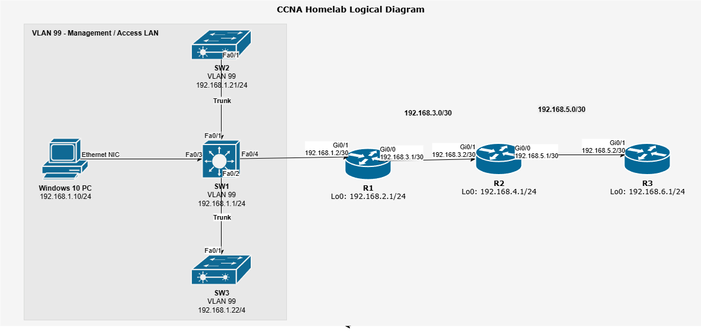

# CCNA Homelab
This is my homelab to help me prepare for the Cisco CCNA 200-301 certification. I'm using real Cisco IOS routers and switches to build practical skills in networking concepts like VLANs, STP, static routing, and more. The goal is to simulate a real-world enterprise environment and reinforce theory with hands-on experience.

## Devices Used
- Cisco 1921 Routers (x3)
- Cisco Catalyst 3560C Switch (x1)
- Cisco Catalyst 3650 24-POE Switch (x1)
- Cisco Catalyst 3560v2 Switch (x1)
- Cisco 2504 WLC Controller (x1)
- Cisco 3602i AP (x1)
- Windows 10 PC (Oracle VM with Win10 & Ubuntu VMs)

## Diagrams
### Logical Topology


## Recent Lab Updates
As of October 2025, this homelab has completed 14 out of 18 planned labs.  
From the last lab, the homelab currently demonstrates:
- Verifying CDP is globally configured on all switches/routers
- Enabled/verified LLDP is configured on all switches/routers
- Compared the differences between the protocols

## Goals
- [x] 1. Cable and Power On Devices
- [x] 2. Set Hostnames and Interface Descriptions
- [x] 3. Device IPs and Default Gateways
- [x] 4. Enable SSH and Remote Access
- [x] 5. VLANs and Trunking
- [x] 6. Implement STP/RSTP
- [x] 7. Static Routing (IPv4)
- [x] 8. Inter-VLAN Routing
- [x] 9. DHCP and DNS (IPv4)
- [x] 10. Dynamic Routing (RIP, EIGRP, OSPFv2)
- [x] 11. IPv6 Routing (OSPFv3)
- [X] 12. Wireless LAN (WLAN)
- [X] 13. IP ACLs and Security Services
- [X] 14. CDP/LLDP Device Discovery
- [ ] 15. NAT/NAT Overload (PAT) Simulation
- [ ] 16. Gateway Redundancy with HSRP
- [ ] 17. SNMP, NTP, and Syslog Monitoring
- [ ] 18. QoS Fundamentals

## Key Subnets
| Device | Interface | IP Address      |
|--------|-----------|-----------------|
| PC     | NIC       | 192.168.1.10/24 |
| SW1    | VLAN 99   | 192.168.1.1/24  |
| SW2    | VLAN 99   | 192.168.1.21/24 |
| SW3    | VLAN 99   | 192.168.1.22/24 |
| R1     | Gi0/1     | 192.168.1.2/30  |
| R1     | Gi0/0     | 192.168.3.1/30  |
| R1     | Lo0       | 192.168.2.1/32  |
| R2     | Gi0/1     | 192.168.3.2/30  |
| R2     | Gi0/0     | 192.168.5.1/30  |
| R2     | Lo0       | 192.168.4.1/32  |
| R3     | Gi0/1     | 192.168.5.2/30  |
| R3     | Lo0       | 192.168.6.1/32  |

## Routing Path
PC > SW1 > R1 > R2 > R3 (and back)

## Project Structure
 ```
ccna-homelab/
├── README.md
├── topology/
│   ├── ccna-homelab.jpg
│   ├── logical-topology.png
│   ├── physical-topology.png
│   └── topology-notes.md
├── configs/
│   ├── routers/
│   │   ├── R1-running-config.txt
│   │   ├── R2-running-config.txt
│   │   └── R3-running-config.txt
│   └── switches/
│       ├── SW1-running-config.txt
│       ├── SW2-running-config.txt
│       └── SW3-running-config.txt
└──labs/
    ├── lab1_cabling_setup.md
    ├── lab8_inter-vlan_routing.md
    ├── lab9_dhcp_and_dns.md
    ├── lab10_dynamic_routing.md
    ├── lab11_ipv6_routing.md
    ├── lab12_wireless_lan.md
    ├── lab13_acls_and_security.md
    ├── lab14_cdp_lldp.md
    └── lab15_nat_overload_pat.md

 ```

## Skills Demonstrated
- Cisco IOS configuration and CLI navigation
- VLANs and 802.1Q trunking
- STP and RSTP implementation
- IP subnetting and static routing
- OSPF, EIGRP, and RIP dynamic routing
- IPv6 addressing and OSPFv3
- SSH and secure remote access setup
- DHCP and DNS server configuration (Ubuntu BIND9)
- Layer 2/3 troubleshooting using `ping`, `traceroute`, `show`, and `debug`

## How to Use This Repo
1. Clone the repository:
   ```bash
   git clone https://github.com/yourusername/ccna-homelab.git
2. Explore the `/configs` directory for running configs.
3. Follow the `/labs` directory for step-by-step guides.

## License
- MIT License
